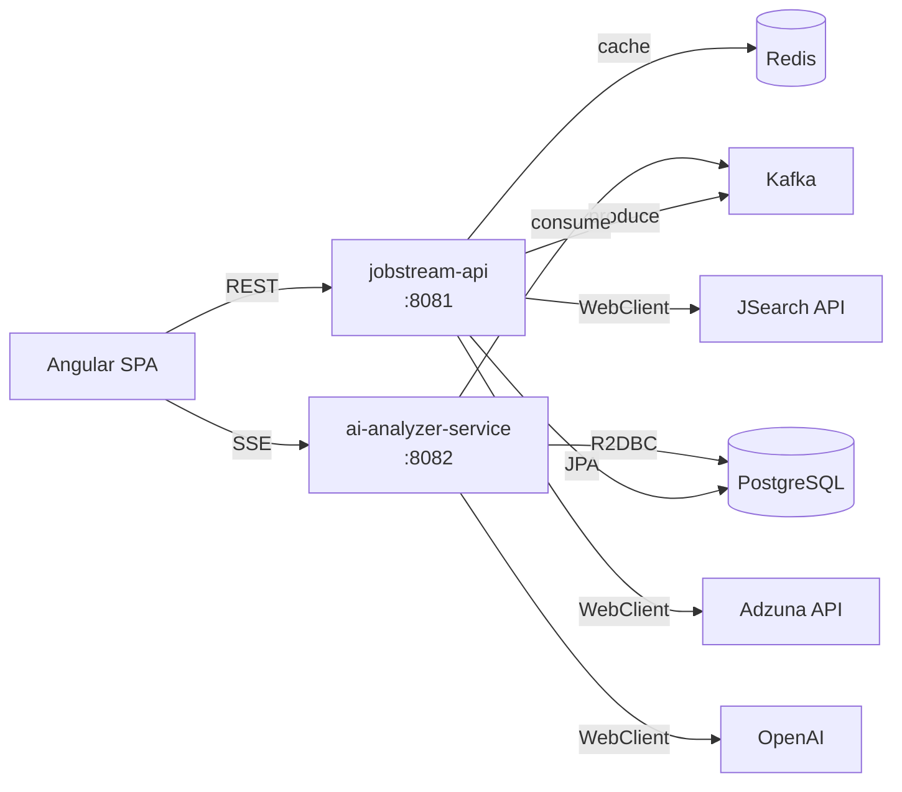
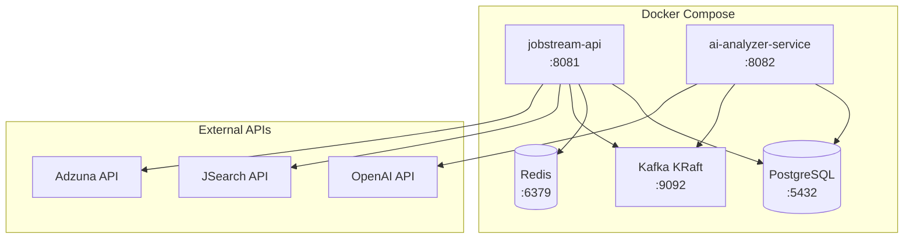

# JobStream

> **Microservices project showcasing Spring Boot, Kafka, AI, and DevOps** — built as a technical portfolio piece.

AI-assisted job candidature platform. Search job offers, analyze their fit with your CV, generate tailored cover letters, and track applications with a kanban board.

## Stack

- **Backend :** Java 25, Spring Boot (WebMVC + WebFlux)
- **Messaging :** Apache Kafka
- **Database :** PostgreSQL + Redis (cache)
- **Frontend :** Angular 22
- **Infra :** Docker, Kubernetes, Prometheus/Grafana

## Architecture

2 event-driven microservices :

| Service | Stack | Port | Role |
|---|---|---|---|
| jobstream-api | Spring WebMVC + JPA | 8081 | Job CRUD, Redis cache, CV upload |
| ai-analyzer-service | Spring WebFlux + R2DBC | 8082 | AI analysis, cover letter, SSE real-time |

### Infrastructure

## Method

Built with the [BMad Method](https://github.com/bmad-code-org/BMAD-METHOD) — AI-driven agile development workflow (agents, phases, ADR-tracked architecture).

## Docs

- [Product Brief](docs/product-brief.md)
- [Architecture Spine](docs/architecture-spine.md)
- [Architecture Decisions](docs/architecture-decisions.md)
