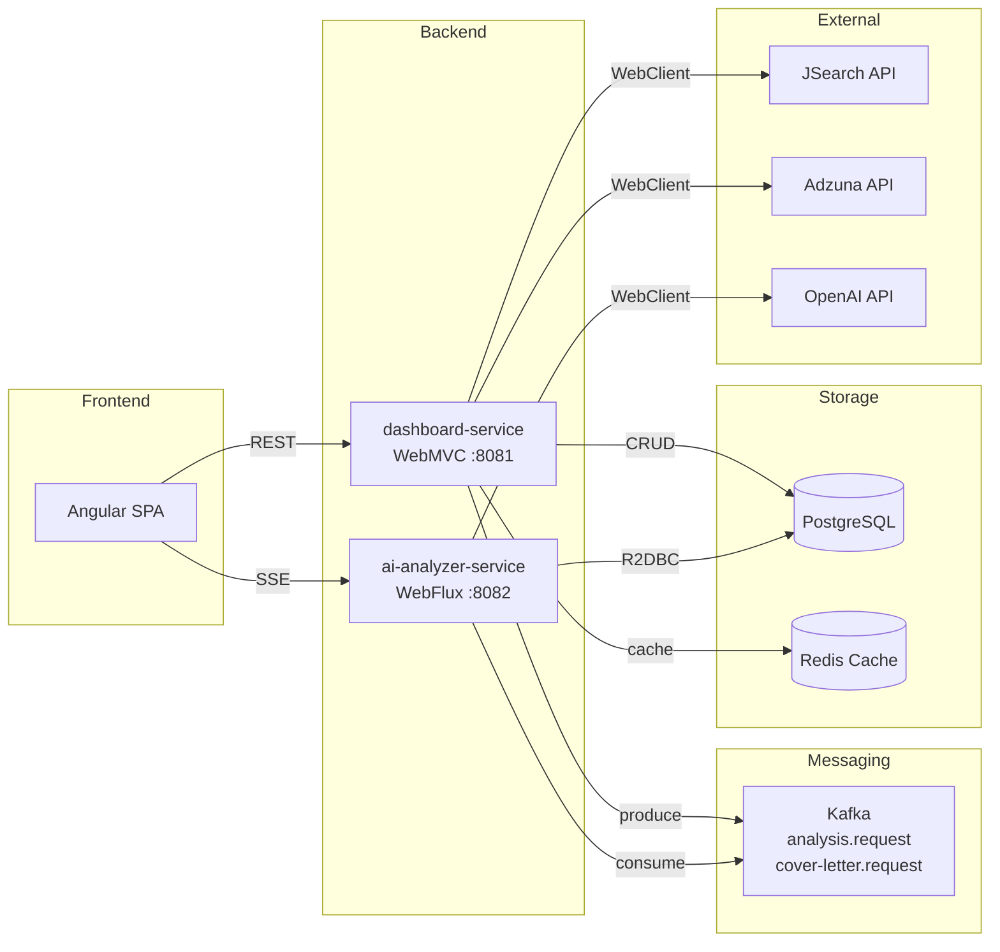
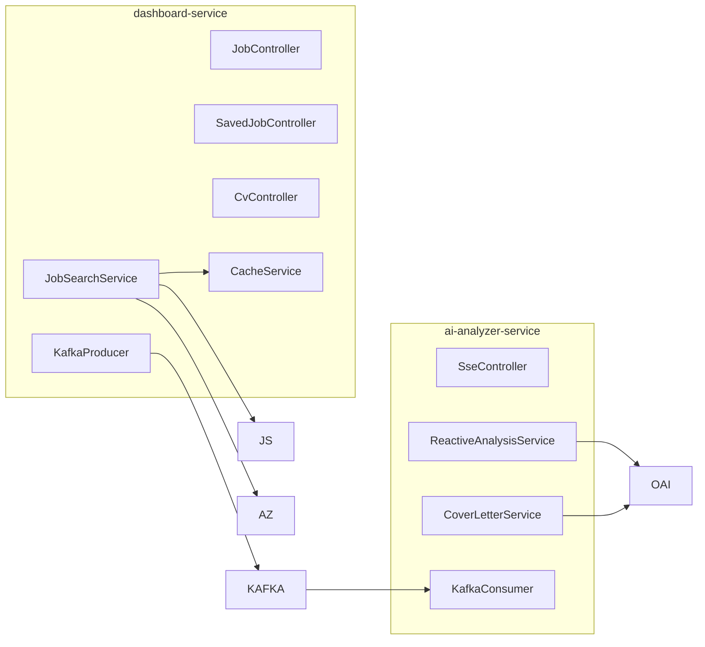
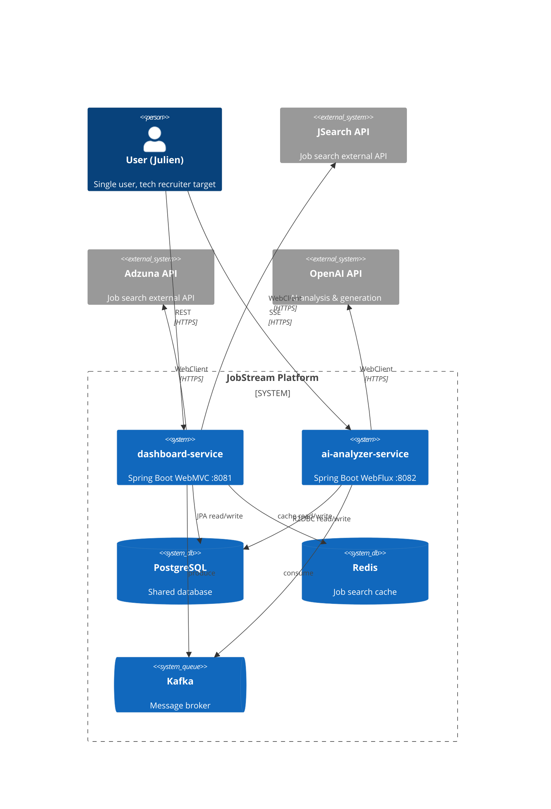
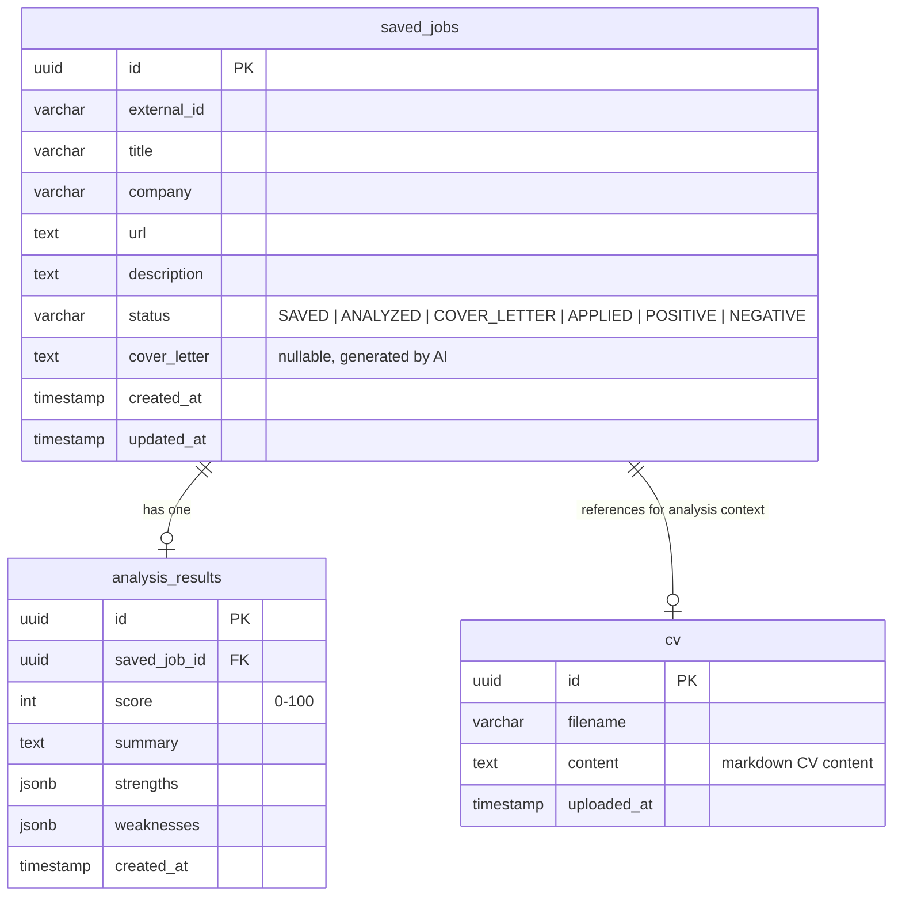
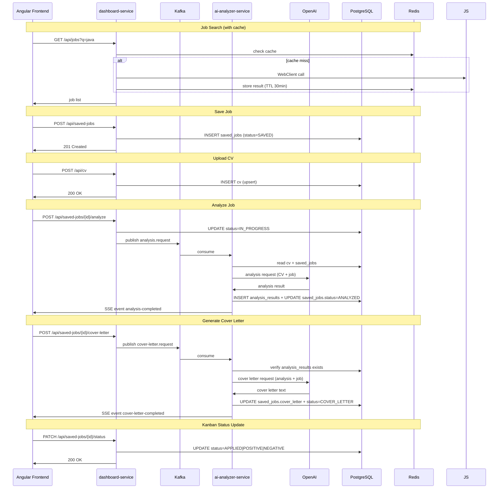

# Architecture Spine — JobStream

## Design Paradigm

**Event-driven microservices** communicating through Apache Kafka. Each service owns its read/write tables in a shared PostgreSQL. The frontend (Angular) communicates with the dashboard-service via REST and receives real-time events from the ai-analyzer-service via SSE.



### Service Boundaries



## Invariants & Rules

### AD-1 — Event-Driven Service Boundary

- **Binds:** `all`
- **Prevents:** Synchronous cross-service calls (no REST between services)
- **Rule:** Services communicate exclusively through Kafka topics. The only allowed synchronous calls are REST from frontend → dashboard, and SSE from analyzer → frontend.

### AD-2 — Shared Database, Isolated Table Ownership

- **Binds:** `all`
- **Prevents:** Two services writing to the same table
- **Rule:** Each service writes exclusively to its own tables. The other service may read but never write. Ownership:

| Table | Owner |
|---|---|
| `saved_jobs` | dashboard-service |
| `cv` | dashboard-service |
| `analysis_results` | ai-analyzer-service |

### AD-3 — Two Kafka Topics

- **Binds:** `all`
- **Prevents:** A single topic carrying heterogeneous message types
- **Rule:** Each async workflow owns a dedicated topic:
  - `analysis.request` — job analysis trigger
  - `cover-letter.request` — cover letter generation trigger
  - Each topic has a corresponding DL topic (`*.DLT`) for failed messages after retry exhaustion

### AD-4 — Cover Letter Depends on Analysis

- **Binds:** `ai-analyzer-service`
- **Prevents:** Generating a cover letter before an analysis result exists
- **Rule:** The ai-analyzer-service must verify `analysis_results` exists for the given `saved_job_id` before processing a `cover-letter.request`. If missing, reject the message (→ DLT).

### AD-5 — Kanban Status in saved_jobs

- **Binds:** `dashboard-service`
- **Prevents:** A separate kanban/state management service or table
- **Rule:** `saved_jobs.status` is an enum: `SAVED → ANALYZED → COVER_LETTER → APPLIED → POSITIVE | NEGATIVE`. Transitions are forward-only; `status` is mutated by the service that owns the preceding step.

### AD-6 — CV Stored in PostgreSQL

- **Binds:** `dashboard-service`
- **Prevents:** Filesystem storage (no local file coupling), object storage (no S3 infra)
- **Rule:** CV content stored as TEXT in table `cv`. One row (single CV for single user). Uploaded via `POST /api/cv` to dashboard.

### AD-7 — Redis for Job Search Cache

- **Binds:** `dashboard-service`
- **Prevents:** Repeated identical API calls within cache TTL
- **Rule:** `GET /api/jobs?q=...` results are cached in Redis with a TTL of 30 minutes. Cache key is the query string. Miss → call external API → store in Redis → return. Hit → return immediately.

### AD-8 — SSE from ai-analyzer-service

- **Binds:** `ai-analyzer-service`
- **Prevents:** Polling from frontend, dashboard-service as SSE intermediary
- **Rule:** Real-time events (`analysis-completed`, `cover-letter-completed`) are pushed exclusively by the ai-analyzer-service via `GET /api/events` (Flux SSE). Single-instance SSE is sufficient (single-user project).

### AD-9 — DLT per Topic

- **Binds:** `ai-analyzer-service`
- **Prevents:** Silent message loss on processing failure
- **Rule:** Each consumer has a dead-letter topic with retry policy (3 retries, exponential backoff). Failed messages land in `*.DLT` for manual inspection / replay.

## Consistency Conventions

| Concern | Convention |
|---|---|
| Naming (entities) | Singular PascalCase (`SavedJob`, `AnalysisResult`) |
| Naming (topics) | kebab-case (`analysis.request`, `cover-letter.request`) |
| Naming (endpoints) | kebab-case plural (`/api/saved-jobs`, `/api/events`) |
| IDs | UUID v4 (all entities) |
| Dates | ISO-8601 UTC (`yyyy-MM-dd'T'HH:mm:ss'Z'`) |
| Error shape | `{ "error": "...", "status": N }` |
| Config | Spring application.yml per service, environment vars for secrets |
| Logging | Structured JSON (Logback), traceable via correlation ID |
| API contracts | Shared DTOs in `common/` module (OpenAPI-generated) |

## Stack

| Name | Version |
|---|---|
| Java | 25 |
| Spring Boot | 3.4.x |
| Spring WebMVC | dashboard-service |
| Spring WebFlux | ai-analyzer-service |
| JPA / Hibernate | dashboard-service |
| R2DBC | ai-analyzer-service |
| Apache Kafka | 3.8.x |
| PostgreSQL | 16 |
| Redis | 7.x |
| Angular | 22 |
| Docker | latest |
| Kubernetes | 1.30 (local: kind/minikube) |

## Structural Seed

### System Context



### Core Entity Model



### Source Tree

```text
backend/
├── common/                          # Shared DTOs (OpenAPI-generated)
│   └── src/main/java/com/jobstream/dto/
│       ├── JobAnalysisRequest.java
│       ├── JobAnalysisResult.java
│       └── CoverLetterRequest.java      # NEW
├── dashboard-service/
│   ├── Dockerfile
│   ├── pom.xml
│   └── src/main/java/com/jobstream/
│       ├── controller/
│       │   ├── JobController.java
│       │   ├── SavedJobController.java
│       │   └── CvController.java         # NEW — POST /api/cv
│       ├── service/
│       │   ├── JobSearchService.java
│       │   ├── AnalysisProducerService.java
│       │   └── CacheService.java         # NEW — Redis cache
│       ├── entity/
│       │   ├── SavedJob.java
│       │   └── Cv.java                   # NEW
│       └── config/
│           ├── KafkaConfig.java
│           ├── RedisConfig.java          # NEW
│           └── WebClientConfig.java
└── ai-analyzer-service/
    ├── Dockerfile
    ├── pom.xml
    └── src/main/java/com/jobstream/analyzer/
        ├── controller/
        │   └── AnalysisEventController.java  # SSE
        ├── service/
        │   ├── ReactiveAnalysisService.java
        │   ├── CoverLetterService.java       # NEW
        │   └── SseBroadcaster.java
        ├── consumer/
        │   ├── AnalysisRequestConsumer.java
        │   └── CoverLetterConsumer.java      # NEW
        └── config/
            ├── KafkaConfig.java
            └── OpenAiConfig.java
```

### Event Flow



## Capability → Architecture Map

| Capability | Lives in | Governed by |
|---|---|---|
| Job search (external APIs) | dashboard-service | AD-7, AD-3 |
| Saved jobs CRUD | dashboard-service | AD-2 |
| Kanban status management | dashboard-service | AD-5 |
| CV upload & storage | dashboard-service | AD-6, AD-2 |
| Job analysis (AI) | ai-analyzer-service | AD-1, AD-3, AD-4 |
| Cover letter generation | ai-analyzer-service | AD-1, AD-3, AD-4 |
| Real-time SSE notifications | ai-analyzer-service | AD-8 |
| Job search caching | dashboard-service | AD-7 |
| Message resilience | ai-analyzer-service | AD-9 |

## Deferred

| Item | Why deferred |
|---|---|
| Multi-instance SSE scaling | Single-user project, not needed until multi-user or cloud deployment |
| Authentication / Authorization | Vitrine project, single user. Revisit if open to public |
| Cloud deployment (Azure) | Post-MVP. Docker Compose serves local dev and vitrine demo |
| CI/CD pipeline | Post-MVP. Manual build until code stabilizes |
| Monitoring & alerting | Prometheus/Grafana scaffold exists in infra/ but not wired until deployment |
| CV versioning / history | Single CV, overwrite-only. Revisit if multiple CVs needed |
| Report export (PDF) | Copy-paste from UI covers MVP needs |
| Testing strategy | To be defined during implementation |
